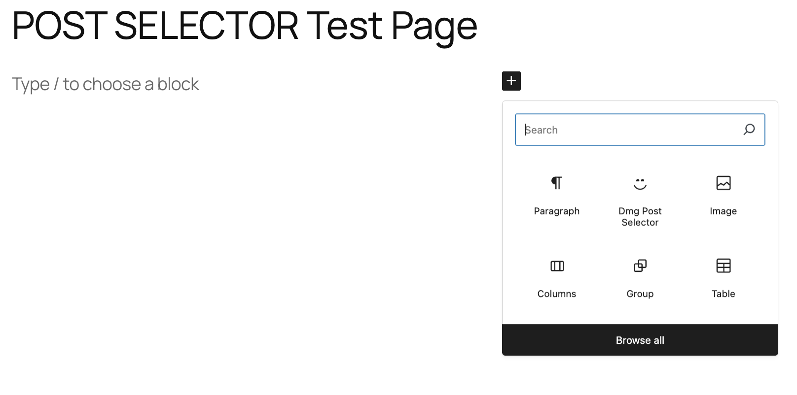
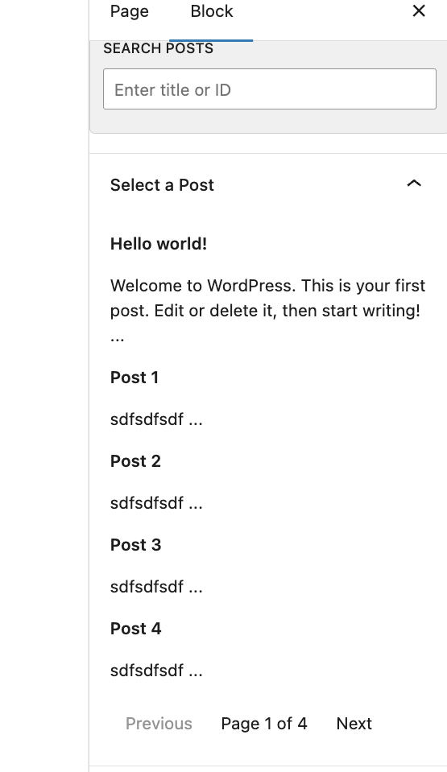
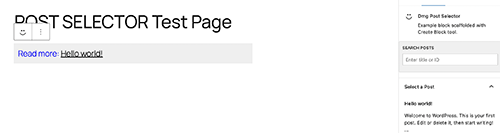

=== Dmg Post Selector ===
Contributors:      The WordPress Contributors
Tags:              block
Tested up to:      6.7
Stable tag:        0.1.0
License:           GPL-2.0-or-later
License URI:       https://www.gnu.org/licenses/gpl-2.0.html

Example block scaffolded with Create Block tool.

== A Gutenberg Block ==

Write a Gutenberg block using native WP React tools (no ACF or other plugin dependencies). This block should allow
editors to search for and then choose a published post to insert into the editor as a stylized anchor link.
Editors should be able to search posts in the InspectorControls using a search string. It should paginate results. It should
support searching for a specific post ID. Recent posts should be shown to choose from by default.
The anchor text should be the post title and the anchor href should be the post permalink. The anchor should be output
within a paragraph element with a CSS class of `dmg-read-more` added to it. The anchor should be prepended with the
words `Read More: `.

Choosing a new post should update the anchor link shown in the editor.

== Installation ==

1. Upload the plugin files to the `/wp-content/plugins/dmg-post-selector` directory, or install the plugin through the WordPress plugins screen directly.
1. Activate the plugin through the 'Plugins' screen in WordPress

== block structure ==

dmg-block-selector/
├── block.json
├── index.php               # (PHP render callback if dynamic)
├── src/
│   ├── edit.js             # Editor component (backend)
│   ├── save.js             # Frontend markup (for static blocks)
│   ├── index.js            # Block registration entry point
│   └── style.scss          # Shared styles
│
├── build/
│   ├── index.js            # Compiled JS from src
│   └── style.css           # Compiled CSS from src
│   └── blocks-manifest.php
│
├── style.css               # Frontend styles (enqueued automatically)
├── editor.css              # Editor-only styles (enqueued automatically)
├── package.json            # Project dependencies and scripts
├── webpack.config.js       # Build config (if customizing build)
└── README.md               # Optional documentation
└── dmg-post-selector.php.  # plugin file

= Using the block =

Using the block inserter ( + ) on the page or top left of editor. 
Select "dmg post selector" from the available blocks
On the right hand inspector column you will see a list of posts. There are 5 per page and the paginator will reflect the number of posts that exist.
Either paginate to the required post or use the search which accepts either a string for the title or a postID
Once you have a visual on the post you wush to insert click on it and it will be inserted into the post as "Read more <a href=[permalink]>Post title</a>

save

== Screenshots ==

== Changelog ==

= 0.0.1 =
* Release

